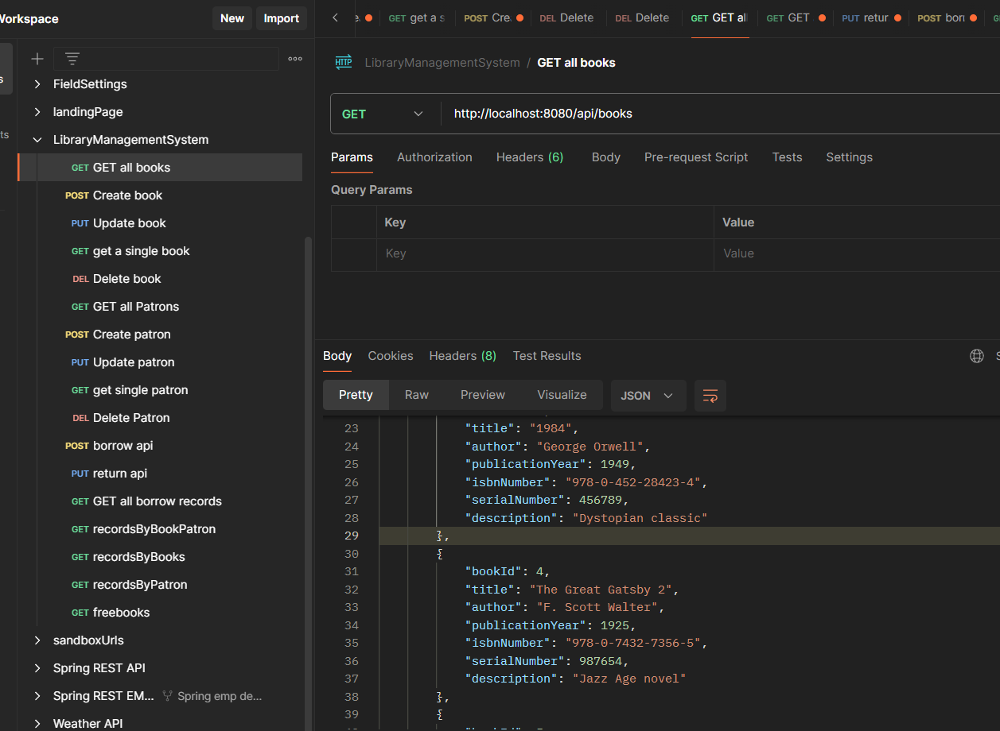

##Library Management App
This is a simple Spring Boot application for Library Management  that manages books and patrons. The application also manages borrowing and returning of books and maintaining a transaction history

## Design considerations
* One patron can borrow multiple books
* Same book cannot be borrowed by two people at the same time.
* System should be able to give list of free books available at any point of time.
* System should have a history of transactions for a book and a patron.
* CRUD API's for each entity should be available.

## TECHSTACK
* Java Spring boot
* REST API's
* H2 Database
* Apache Tomcat Server
* Swagger API
* Mockito Tests
* Transactional

## Postman Collection with list of API's
* Start the application by running Library Application.java class and run below end points to see data.
  
  [Postman_collection](Postman_collection)

## Entities
Book
Represents a book in the library.

## Patron
Represents an patron/user who borrows/returns book in the library.

## Borrowing Records
Represents an record when a patron who borrows/returns book in the library.

## Database entities
| Table Name          | Columns                                                                                                    | Constraints                                                                                                                             |
|---------------------|------------------------------------------------------------------------------------------------------------|-----------------------------------------------------------------------------------------------------------------------------------------|
| Borrowing Records  | borrowing_id (PK) book_id (FK: books.book_id) patron_id (FK: patrons.patron_id),  borrowing_date, return_date, book_state | Unique constraint on (book_id, patron_id, borrowing_date)                                                                             |
| Books               | book_id (PK), title (Unique), author  (Unique), publication_year, isbn_number, serial_number (Unique), description | Unique constraint on title, author, Unique constraint on serial_number                                                                          |
| Patrons             | patron_id (PK), name, contact_no, email_address (Unique) address                                           | Unique constraint on email_address                                                                                                    |

## API Endpoints
Link - https://pavs1605.github.io/LibraryManagementAPI/
### Book

### Patron

### Borrowing Record

## Test Report Results
Run tests using mvn test
Output :
main] .c.s.DirtiesContextTestExecutionListener : After test class: class [LibraryApplicationTests], class annotated with @DirtiesContext [false] with mode [null]
[INFO] Tests run: 1, Failures: 0, Errors: 0, Skipped: 0, Time elapsed: 9.416 s -- in com.books.library.LibraryApplicationTests
[INFO] Running com.books.library.repository.BorrowingRecordRepositoryTest
[INFO] Tests run: 2, Failures: 0, Errors: 0, Skipped: 0, Time elapsed: 0.558 s -- in com.books.library.repository.BorrowingRecordRepositoryTest
[INFO] Running com.books.library.service.BookServiceImplTest
[INFO] Tests run: 6, Failures: 0, Errors: 0, Skipped: 0, Time elapsed: 0.493 s -- in com.books.library.service.BookServiceImplTest
[INFO] Running com.books.library.service.BorrowingRecordServiceImplTest
[INFO] Tests run: 8, Failures: 0, Errors: 0, Skipped: 0, Time elapsed: 0.178 s -- in com.books.library.service.BorrowingRecordServiceImplTest
[INFO] Running com.books.library.service.PatronServiceImplTest
[INFO] Tests run: 6, Failures: 0, Errors: 0, Skipped: 0, Time elapsed: 0.037 s -- in com.books.library.service.PatronServiceImplTest
[INFO]
[INFO] Results:
[INFO]
[INFO] Tests run: 23, Failures: 0, Errors: 0, Skipped: 0
[INFO]
[INFO] ------------------------------------------------------------------------
[INFO] BUILD SUCCESS
[INFO] ------------------------------------------------------------------------
[INFO] Total time:  16.332 s
[INFO] Finished at: 2024-01-29T06:42:26+04:00
[INFO] ------------------------------------------------------------------------

